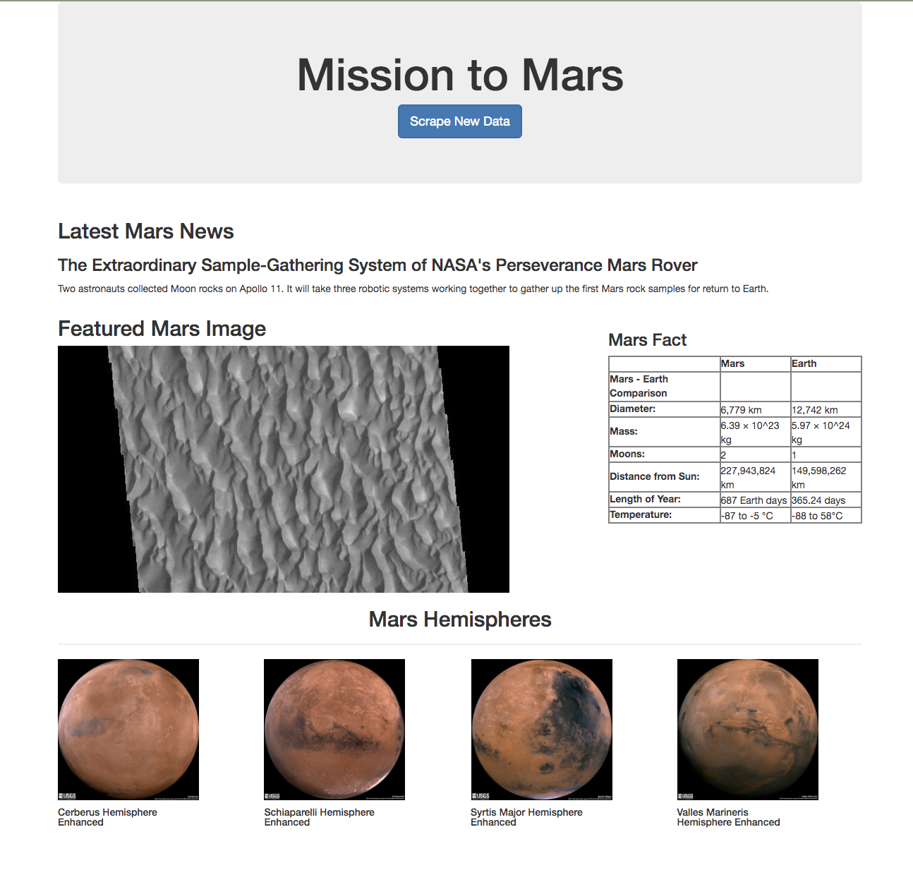

# web-scraping-challenge

This github page contains:
- Jupyter Notebook that I used to scrape webpage data
- Flask app (app.py) that connects and insert data to and from MongoDB
- Render template (scrape_mars.py) that 
- index.html that displays all of scraped data

## Screenshot of final application

